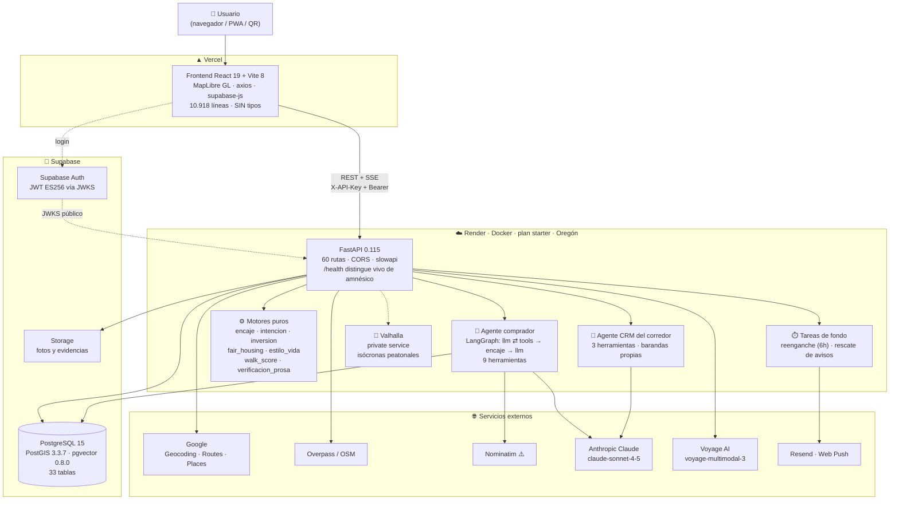
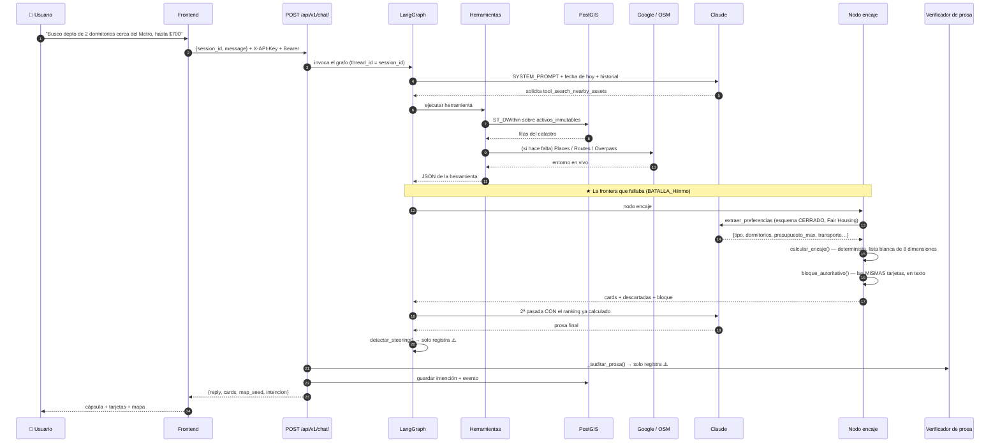
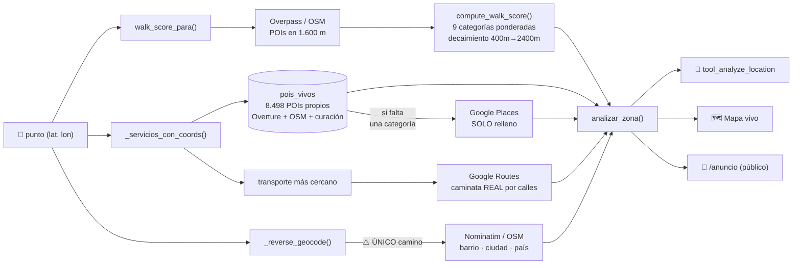
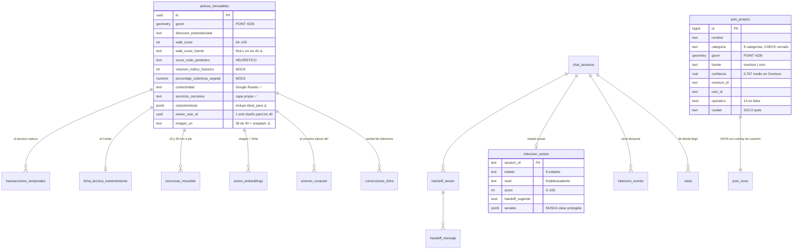
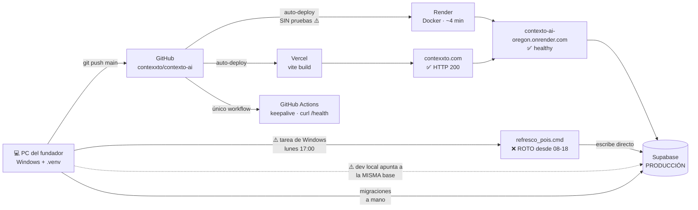

# CONTEXTO AI — Arquitectura real
### Documento complementario de la auditoría del 2026-08-19
**Commit analizado:** `782e57ba` · **Regla:** solo se dibuja lo que se pudo verificar.

---

## 0. Advertencia de lectura

Los diagramas de este documento **no representan la arquitectura deseada** que aparece en `docs/ESTRATEGIA_API_First.md` ni en `docs/VISION_Sistema_Vivo.md`. Representan lo que existe y se pudo comprobar leyendo el código, consultando la base de producción y llamando a la API desplegada.

Cada componente lleva su marca:
- **Línea sólida / caja normal** = verificado en producción.
- **Línea punteada** = existe en código, no validado en uso.
- ⚠️ = discrepancia con la documentación o con las decisiones zanjadas.

---

## 1. Mapa del repositorio

```
Contexto-AI/                       550 archivos versionados · 784 commits (jun–ago 2026)
│
├── main.py                        Punto de entrada FastAPI: lifespan, CORS, 9 routers, /health
├── Dockerfile                     python:3.11-slim → uvicorn (lo despliega Render)
├── render.yaml                    ⚠️ NO es la fuente de verdad de las variables (lo dice él mismo)
├── requirements.txt               24 dependencias de producción
│
├── app/                           BACKEND — 16.106 líneas, 51 módulos
│   ├── routers/                   9 routers → 60 rutas
│   │   ├── chat.py       2.484 L  ⚠️ el más grande: chat, sesiones, handoff, avisos, push
│   │   ├── assets.py     2.452 L  ⚠️ catastro, QR, letrero, mapa, inversión, CRM, leads, entorno
│   │   ├── ingest.py       460 L  ingesta visual + similitud
│   │   ├── match.py        263 L  intake de brief (C0)
│   │   ├── review.py       224 L  cola de revisión humana
│   │   ├── alertas.py      165 L  la "puerta suave"
│   │   ├── auth.py         148 L  perfil y rol
│   │   ├── visitas.py      123 L  registro de llegadas
│   │   └── vision.py        56 L  extracción visual
│   │
│   ├── agent/                     CAPA DE AGENTES
│   │   ├── graph.py        862 L  grafo del comprador + SYSTEM_PROMPT (568 líneas)
│   │   ├── tools.py        755 L  las 9 herramientas
│   │   ├── crm_guardrails  455 L  barandas del agente del corredor
│   │   ├── crm_graph.py    276 L  grafo del corredor
│   │   ├── crm_tools.py    227 L  3 herramientas del CRM
│   │   ├── panel_seed.py   120 L
│   │   ├── siguiente.py     94 L
│   │   └── state.py         56 L
│   │
│   ├── ── MOTORES PUROS (sin red, sin base — el mejor código del proyecto) ──
│   │   ├── verificacion_prosa.py  464 L   prosa del LLM vs números del motor
│   │   ├── encaje.py              418 L   encaje 0-100, lista blanca cerrada
│   │   ├── encaje_contexto.py     254 L   el bloque autoritativo que lee el modelo
│   │   ├── walk_score.py          226 L   caminabilidad sobre POIs de OSM
│   │   ├── estilo_vida.py         205 L   concepto difuso → dato / servicio / sin-dato / rechazo
│   │   ├── intencion.py           206 L   9 estados de intención, explicable
│   │   ├── fair_housing.py        149 L   detector de sesgo territorial
│   │   ├── inversion.py            90 L   rentabilidad bruta/neta, precio/m²
│   │   └── scores_heuristicos.py   67 L   ⚠️ tabla fija de 7 sectores [HARDCODEADO]
│   │
│   ├── ── INFRAESTRUCTURA / DOMINIO ──
│   │   ├── rutas.py             1.108 L  motor de entorno: capa propia + Google + OSM
│   │   ├── notifications.py       408 L  Resend + Web Push (VAPID)
│   │   ├── reenganche_cron.py     309 L  tarea de fondo dentro de la app (cada 6 h)
│   │   ├── models.py              267 L  9 modelos ORM
│   │   ├── puerta / llegada / embudo / orden / pendiente / lift / preferencias /
│   │   │   reenganche / rescate_avisos / entorno / entorno_curacion / isocronas /
│   │   │   vision / embeddings / auth / config / database / limiter / schemas
│   │
├── frontend/                      FRONTEND — 10.918 líneas, React 19 + Vite 8
│   ├── src/App.jsx       2.211 L  ⚠️ enrutamiento, sesión, chat, handoff, mapa, publicación
│   ├── src/MapView.jsx   1.002 L  MapLibre GL
│   ├── src/CRM.jsx         709 L
│   ├── src/MapSeed.jsx     529 L
│   └── … 36 archivos más
│
├── migrations/                    25 archivos .sql numerados (002 → 026), aplicados A MANO
├── tests/                         52 archivos, 771 casos — todos en verde
├── evals/                         suite de honestidad (11 casos) — a mano, no en CI
├── scripts/                       24 utilidades: foso_pois_spike, hidratar_activos, QRs, estudio…
├── docs/                          ~180 documentos — el mayor activo intelectual
├── logs/                          4 registros del refresco de POIs ⚠️ el último FALLA
│
└── ── NO PRODUCTO ──
    ├── mockups/ preview/ lanzamiento-pyme/     maquetas y material de piloto PYME
    ├── contenido/                              máquina de contenido (despachos quincenales)
    ├── logo/ + Contexto_AI_Brand/logo/         ⚠️ 10 SVG duplicados exactos
    └── seed_*.py, *.sql, gen_*.py              8 artefactos de siembra solapados
```

---

## 2. Arquitectura verificada — vista general



---

## 3. El camino de una consulta — verificado paso a paso



**El paso 15 es la decisión de arquitectura más importante del proyecto.** Antes de agosto, el encaje se calculaba *después* de que el modelo escribiera, solo para pintar tarjetas — y por eso la prosa y las tarjetas contaban historias distintas. `[VERIFICADO — `app/agent/graph.py:707-748`]`

---

## 4. El motor de entorno — dónde entra cada fuente



**Cambio real y verificado de julio 2026:** antes eran **7 llamadas a Google Places por consulta**; ahora son **2 consultas a la base propia** y Google solo entra por los huecos. Esa es la migración del foso, y funcionó. `[VERIFICADO — `app/rutas.py:364-405`]`

---

## 5. Modelo de datos verificado



**El acierto del modelo:** la separación activo permanente / anuncio efímero. Es la tesis del negocio expresada como esquema, y está bien hecha.

**El problema del modelo:** `caracteristicas` es un JSONB libre con **25 llaves distintas observadas en producción**, entre ellas `precio` (que duplica y contradice el precio de `transacciones_temporales`: $200 vs $180 en el inmueble real) e `ideal_para` (que contradice Fair Housing).

---

## 6. Despliegue verificado



**Las tres fragilidades que este diagrama hace visibles:**
1. **No hay puerta antes de producción.** 771 pruebas existen y no bloquean nada.
2. **La tubería de datos crítica vive en un portátil**, escribe directo a producción y lleva rota desde el 18 de agosto.
3. **Desarrollo y producción comparten base.** Ya causó un incidente de 1h26m (`docs/INCIDENTE_2026-08-18_Pools.md`).

---

## 7. Arquitectura PREVISTA (documentada, no construida)

Para que nadie confunda plan con realidad. Todo lo de esta lista aparece en `docs/` y **no existe en el código**:

| Componente previsto | Dónde se promete | Estado real |
|---|---|---|
| **Market API** (€/m² por barrio, comparables, demanda) | `ESTRATEGIA_API_First.md` | ❌ No implementada |
| **Scoring API por estrategia** (alquiler / flipping / value-add) | ídem | ❌ No implementada |
| **Webhooks** ("nuevo activo que supera tu tesis") | ídem | ❌ No implementada |
| **Identity API / OAuth 2.0** para terceros | ídem | ❌ Solo una `API_KEY` global |
| **Sandbox + claves autoservicio + Store** | ídem | ❌ No existe |
| **UI Integration API** (incrustar componentes) | ídem | ❌ No existe |
| **Multi-ciudad operativa** | migración 019 | 🟡 El esquema lo soporta; solo `quito` cargado |
| **Bloqueo por Fair Housing** (no solo registro) | `COMPLIANCE_FairHousing_AgentSpec` | 🟡 Detector construido, en modo observación |
| **Historial de eventos urbanos** (obras, restricciones de altura) | modelo ORM + prompt | ❌ Tabla con 0 filas |
| **La cuña** (búsqueda por ancla + tiempo) | `SPEC_Foso` §2.4 | 🟡 `buscar_por_ancla_tiempo()` existe; sin uso en datos |

---

## 8. Arquitectura INFERIDA (probable, no demostrable)

Marcado explícitamente como `[NO VERIFICADO]`:

- **Valhalla en Render:** `render.yaml` lo declara como *private service*, `VALHALLA_URL` es `sync:false`. **No pude comprobar si el servicio está vivo hoy.** Las 78 isócronas son todas del 2026-07-01, lo que es compatible tanto con "funciona y no se ha necesitado" como con "está caído desde julio".
- **Copias de seguridad de la base:** dependen del plan de Supabase. Fuera del alcance del repositorio.
- **Restricciones de la clave de Google Maps** (por referente / por IP): no verificable desde el código.
- **Coste mensual real:** ninguna cifra en el repositorio.

---

## 9. Resumen de la arquitectura en una frase

> **Un monolito FastAPI bien modulado, con siete motores deterministas de calidad alta y una capa propia de datos geoespaciales genuinamente valiosa, desplegado sin integración continua, sin preproducción y sin observabilidad, y alimentado por una tubería que corre en el portátil del fundador y lleva rota desde hace un día.**

El código es mejor que la operación. Esa asimetría es el mensaje principal de este documento.
